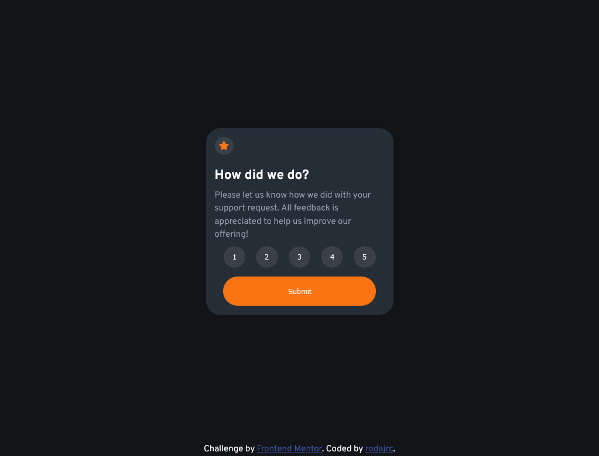

# Frontend Mentor - Interactive rating component solution

This is a solution to the [Interactive rating component challenge on Frontend Mentor](https://www.frontendmentor.io/challenges/interactive-rating-component-koxpeBUmI). Frontend Mentor challenges help you improve your coding skills by building realistic projects. 

## Table of contents

- [Overview](#overview)
  - [The challenge](#the-challenge)
  - [Screenshot](#screenshot)
  - [Links](#links)
- [My process](#my-process)
  - [Built with](#built-with)
  - [Useful resources](#useful-resources)
- [Author](#author)

## Overview

### The challenge

Users should be able to:

- View the optimal layout for the app depending on their device's screen size
- See hover states for all interactive elements on the page
- Select and submit a number rating
- See the "Thank you" card state after submitting a rating

### Screenshot

### Links

- Solution URL: [Rate app github repository](https://github.com/AzJRC/frontend_mentor_projects.git)

## My process

### Built with

- HTML5
- [SASS](https://sass-lang.com/) - CSS preprocessor
- Flexbox
- Mobile-first workflow

### Useful resources

- [ChatGPT3](https://openai.com/blog/chatgpt) - ChatGPT helped me when I got stuck in JavaScript and with some minor typo errors.
- [MDN](https://developer.mozilla.org/en-US/) - This is the best page that I found to learn and study.

## Author

- Github - [AzJRC](https://github.com/AzJRC)
- Frontend Mentor - [@AzJRC](https://www.frontendmentor.io/profile/AzJRC)
